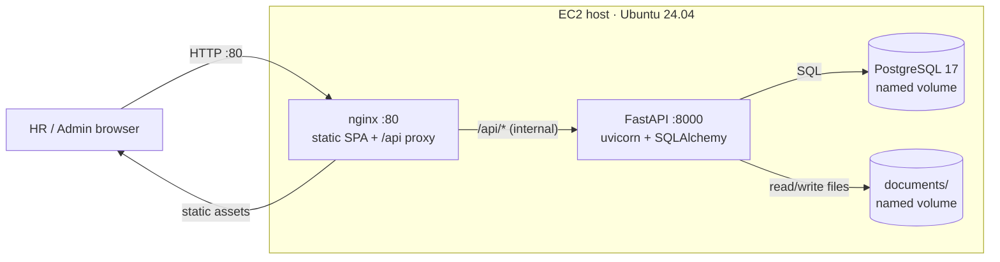
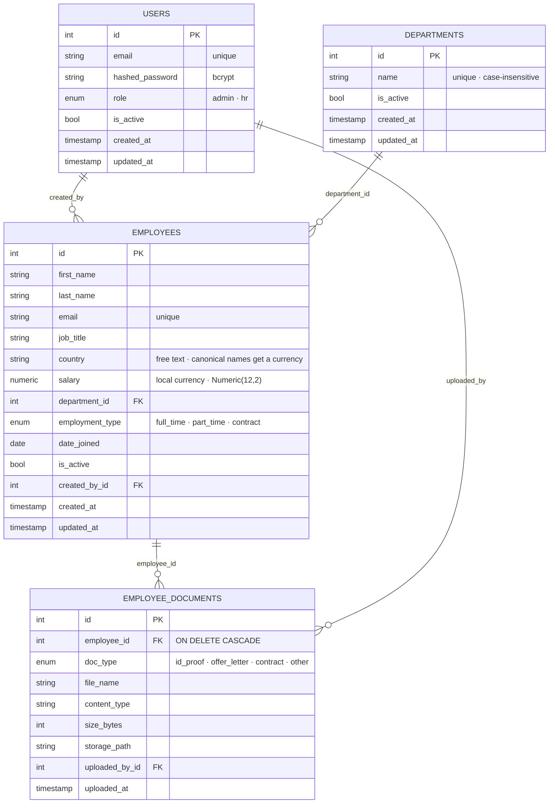

# HLD — HRM Tool (Salary Management)

> A high-level look at how the system is put together: the runtime topology, the data model, and the design calls behind both. Diagrams are Mermaid — GitHub renders them inline.

---

## 1. Runtime architecture

**Key points**
- Only port 80 is exposed to the public. Postgres and the backend live on the internal compose network — no host port mappings in `docker-compose.prod.yml`.
- Frontend is a Vite production build served as static files by nginx; the same nginx reverse-proxies `/api/*` to the backend. The browser always talks to one origin, so no CORS dance.
- Backend container runs `alembic upgrade head` on start, then hands off to uvicorn — schema migrations are self-applying on every deploy.
- Document uploads land on a named Docker volume bind-mounted at `/data/documents`. The named volume inherits the `app:app` ownership from the image so the non-root container can write to it.

---

## 2. Data model (ER)

Reference data (lives in code, not the DB):
- `app/reference/countries.py` — canonical `(name, ISO 4217)` catalog. Served at `GET /api/countries`. The seed and `Employee.currency` both read from this single source.

---

## 3. Schema decisions worth calling out

| # | Decision | Why |
|---|----------|-----|
| 1 | `department_id` FK instead of a `department` string on `employees` | The first version had a string column. Once analytics started filtering on it ("salary by department"), drift was inevitable — "Engineering" vs "engineering" vs " engineering". Lifted into a `departments` table with case-insensitive uniqueness in commit `feat(backend): department FK and migration`. |
| 2 | `country` stays a string, not a FK | Countries are reference data, not user-managed records. A `countries` table would add ceremony with no gain. The currency mapping is solved by a code-level catalog (`app/reference/countries.py`) exposed at `/api/countries`. Unknown countries → `currency = null` on the response, frontend renders the bare amount. |
| 3 | Salary as `Numeric(12, 2)`, currency derived from country | Storing a `currency_code` per row was considered but rejected — it's redundant when one country = one currency for this scope. If a contractor in Berlin is ever paid in USD, the right fix is a `currency_code` column on `employees`; the API layer is already shaped to handle it. |
| 4 | Soft delete on employees (`is_active`) | Documents and audit trails need the row to survive. `DELETE /employees/{id}` flips the flag; queries default to `is_active = TRUE`. Hard-delete on documents (rows + files) because they're orthogonal to the employee record. |
| 5 | Employee documents on a Docker volume, not S3 | Self-contained for the assessment — reviewer doesn't need cloud creds. The router writes to `STORAGE_ROOT/<employee_id>/<uuid>.<ext>`; swapping for S3 is a one-file change in `app/documents/router.py`. |
| 6 | bcrypt with a per-user salt for passwords | Standard. Hash lives in `users.hashed_password`; verification is via `User.verify_password()`. JWT auth on top, 60-minute access tokens. |

---

## 4. Cross-cutting design calls

### TDD as the design driver
Every behavioral feature lands as a pair: a `test(...)` commit with the failing assertion, then a `feat(...)` commit that makes it pass. The git log reads as a design narrative — see `git log --oneline` for the trail.

### One concern per commit
Refactors are their own commits. Renames are their own commits. A reviewer reading the log should be able to map each commit to a discrete design decision.

### Sync SQLAlchemy, not async
`async` would buy nothing here — the workload is OLTP CRUD + small aggregations over ~10k rows. A sync session, `def` handlers, and proper connection pooling are simpler and easier to reason about. FastAPI runs `def` handlers in a thread pool so the event loop stays responsive.

### Server-owned reference data
The first version had a country→currency map in the frontend (`frontend/src/lib/currency.js`). That was a layering smell — business reference data shouldn't live in the rendering layer. Moved to `app/reference/countries.py` and surfaced via `/api/countries`. The seed and the live employee/insight responses both read from the same place, so they can never drift.

### Production vs dev compose
Two compose files. `docker-compose.yml` mounts source code and runs the Vite dev server + uvicorn `--reload`. `docker-compose.prod.yml` builds proper images, runs nginx in front of the SPA, exposes only :80, and self-applies migrations on start. The same backend image powers both — dev simply overrides the command.

### Currency display
Backend returns `currency` as an ISO 4217 code on every employee and salary-insight row. The frontend renders the **bare number** and shows the code once per row (a Currency column on "Salary by country") or in the column header ("Avg salary (INR)") rather than prefixing every cell with locale symbols like `A$` / `CA$`. Cleaner tables, same information.

---

## 5. Trade-offs we knowingly took

1. **No company-wide average salary tile on the dashboard.** Averaging across currencies is misleading; the dashboard's KPI tiles are headcount, departments active, countries covered. The per-country panel does the rest.
2. **Country catalog is a Python tuple, not a DB table.** Reviewer can add a country with a one-line code change + redeploy. A `countries` admin UI was deliberately out of scope.
3. **No global rate limiter / WAF.** This is an internal HR tool behind a corporate VPN in production; the assessment intentionally doesn't add the operational complexity.
4. **Salary band alerts were dropped from the original spec.** Outlier flagging without a seniority signal produces noisy alerts. The data model doesn't carry seniority, so we'd be flagging the wrong people. Noted in the README as "what we'd build next".
